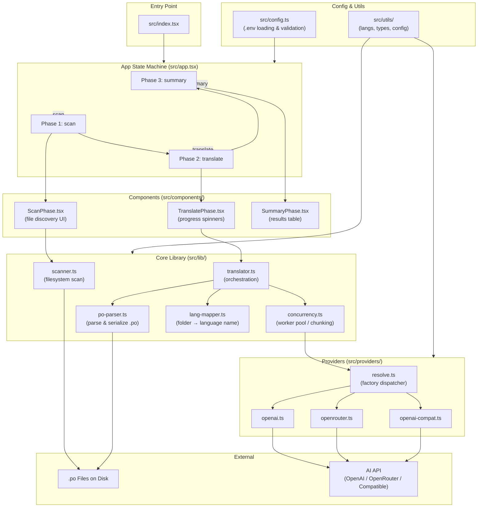

# Alya - Translating your localization with ease using AI

_Alya sometimes hides her feelings in Russian, but your software shouldn't hide its meaning in any language._

A CLI tool that automatically translates software localization files (`.po` format) into multiple languages using AI, with pluggable provider support.

## Why the name "Alya"?

<p align="center">
  
</p>

Inspired by the anime _Alya Sometimes Hides Her Feelings in Russian_, this tool is built around the concept of seamless translation. Just as the character Alya switches languages to express her true thoughts, **Alya the CLI** ensures your application can fluently speak to users worldwide. It bridges the language barrier by translating your text while perfectly preserving the underlying "feelings"—maintaining your exact UI tone, structural placeholders, and context without getting lost in translation.

## Features

- **Multi-language support**: Translates to 11 supported languages (es, fr, hi, it, ja, ne, ru, vi, zh-CN, zh-HK, zh-TW)
- **Pluggable AI providers**:
  - **OpenAI** — Native OpenAI API support
  - **OpenRouter** — Access to 200+ models from different providers
  - **OpenAI-compatible** — Generic endpoint support (LM Studio, Ollama, etc.)
- **Smart translation**:
  - Preserves placeholders like `{0}`, `{name}`, `{priceDisplay}`
  - Skips placeholder-only entries
  - Maintains UI tone and brevity
- **Concurrent processing**: Configurable batch size and chunk size for efficient API usage
- **Progress UI**: Real-time progress bars and status indicators via React + Ink
- **Auto-write**: Translations are automatically written back to `.po` files without confirmation

## Installation

```bash
bun install
```

### Dependencies

- `react` ^19.1.0 — React core
- `ink` ^6.7.0 — React for terminal UIs
- `@ai-sdk/openai` — Native OpenAI provider
- `@ai-sdk/openai-compatible` — Generic OpenAI-compatible endpoints
- `@openrouter/ai-sdk-provider` — OpenRouter multi-model gateway
- `ai` — Vercel AI SDK with `generateObject` for structured outputs
- `zod` — TypeScript-first schema validation

## Configuration

Create `.env` file in the project root. See `.env.example` for a template:

```bash
# Which AI provider to use
AI_PROVIDER=openai-compat  # "openai" | "openrouter" | "openai-compat"

# API credentials
AI_API_KEY=sk-...
AI_BASE_URL=https://openrouter.ai/api/v1  # Required for openai-compat, optional for openai

# Model identifier
AI_MODEL=x-ai/grok4.1

# File scanning
SCAN_ROOT=../..                              # Directory to scan (default: cwd)
SCAN_EXCLUDE=node_modules,.git,dist           # Folders to skip
FILE_EXTENSIONS=.po                           # File extensions to match

# Performance tuning
BATCH_SIZE=5                                  # Concurrent language workers
CHUNK_SIZE=30                                 # Strings per API request
```

### Provider Configuration Examples

#### Native OpenAI

```env
AI_PROVIDER=openai
AI_API_KEY=sk-proj-...
AI_MODEL=gpt-4o
# AI_BASE_URL=https://api.openai.com/v1  # Optional, for custom endpoints
```

#### OpenRouter

```env
AI_PROVIDER=openrouter
AI_API_KEY=sk-or-v1-...
AI_MODEL=anthropic/claude-sonnet-4
# Available models: openai/gpt-4o, google/gemini-2.0-flash, meta-llama/llama-2-70b, etc.
```

#### OpenAI-Compatible (default)

```env
AI_PROVIDER=openai-compat
AI_API_KEY=sk-or-v1-...
AI_BASE_URL=https://openrouter.ai/api/v1
AI_MODEL=x-ai/grok4.1
# Works with any OpenAI-compatible endpoint:
# - LM Studio
# - Ollama
# - Together AI
# - etc.
```

## Usage

```bash
# Run the translator
bun start

# Type checking
bun run check-types

# Linting
bun run lint
bun run lint:fix

# Formatting
bun run format
```

## How It Works

### 1. Scan Phase

The app scans the configured root directory for `.po` files, organized by language folder:

```
locales/
├── en/messages.po          (skipped - source language)
├── es/messages.po
├── fr/messages.po
├── vi/messages.po
└── zh-CN/messages.po
```

### 2. Translate Phase

For each language:

1. Parse the `.po` file to find untranslated entries (`msgstr` is empty)
2. Filter out placeholder-only entries (e.g., `{0}`, `{priceDisplay}`)
3. Chunk strings (configurable size, default 30)
4. Send chunks to the AI provider with a system prompt emphasizing:
   - Preserve all placeholders exactly
   - Don't translate brand names
   - Match original tone and brevity
5. Write translations back to the `.po` file
6. Show progress with per-language spinners

### 3. Summary Phase

Display final results with:

- Total strings translated per language
- Failures (if any)
- Overall success count

## Project Structure

```
ai-translator
├── src/
│   ├── index.tsx              # Entry point
│   ├── app.tsx                # Main App component (3-phase state machine)
│   ├── config.ts              # Configuration loading & validation
│   ├── types.ts               # Shared TypeScript types
│   ├── components/
│   │   ├── ScanPhase.tsx      # File scanning UI
│   │   ├── TranslatePhase.tsx # Translation progress UI
│   │   └── SummaryPhase.tsx   # Results summary UI
│   ├── lib/
│   │   ├── po-parser.ts       # PO file parser & serializer
│   │   ├── scanner.ts         # File system scanner
│   │   ├── lang-mapper.ts     # Folder name → language name
│   │   ├── concurrency.ts     # Worker pool & chunking
│   │   └── translator.ts      # Translation orchestration
│   ├── utils/
│   │   ├── index.ts           # Export all utils
│   │   ├── types.ts           # Shared types
│   │   ├── langs.ts           # Config supported languages for the application
│   │   └── config.ts          # Environment variables configuration
│   └── providers/
│       ├── types.ts           # AIProvider interface
│       ├── openai.ts          # Native OpenAI adapter
│       ├── openrouter.ts      # OpenRouter adapter
│       ├── openai-compat.ts   # Generic OpenAI-compatible
│       ├── resolve.ts         # Provider factory dispatcher
│       └── index.ts           # Barrel re-exports

├── package.json
├── tsconfig.json
├── eslint.config.cjs
├── .env.example
└── README.md
```

## Architecture Diagram



## Architecture: Provider Adapter Pattern

The app uses a **pluggable provider adapter pattern** for flexibility:

```typescript
interface AIProvider {
  readonly name: string;
  getModel(): LanguageModel;
}
```

Each provider is a simple factory that wraps the AI SDK and returns a `LanguageModel`. To add a new provider:

1. Create `src/providers/new-provider.ts`:

   ```typescript
   export function createNewProviderAdapter(config: ProviderConfig): AIProvider {
     // Initialize provider
     return {
       name: 'New Provider',
       getModel: () => provider(config.model),
     };
   }
   ```

2. Add dispatch case in `src/providers/resolve.ts`:

   ```typescript
   case 'new-provider':
     return createNewProviderAdapter({ ... });
   ```

3. Update `.env.example` documentation

**No changes needed** to translator, app, or any other code!

## Performance Tips

- **Batch Size**: Controls concurrent language workers. Increase for more parallelism, decrease to avoid rate limits.
- **Chunk Size**: Strings per API request. Smaller chunks = more API calls but cheaper per call. Larger chunks = fewer calls but pricier per call.
- **Provider choice**:
  - OpenAI: Fast, expensive, best quality
  - OpenRouter: Multiple models, easy switching, variable pricing
  - OpenAI-compatible: Self-hosted options, no API calls, free (but slower)

## Supported Languages

| Language              | Code  | Status           |
| --------------------- | ----- | ---------------- |
| English               | en    | Source (skipped) |
| Spanish               | es    | Translated       |
| French                | fr    | Translated       |
| Hindi                 | hi    | Translated       |
| Italian               | it    | Translated       |
| Japanese              | ja    | Translated       |
| Nepali                | ne    | Translated       |
| Russian               | ru    | Translated       |
| Vietnamese            | vi    | Translated       |
| Chinese (Simplified)  | zh-CN | Translated       |
| Chinese (Hong Kong)   | zh-HK | Translated       |
| Chinese (Traditional) | zh-TW | Translated       |

## Troubleshooting

### "Missing required environment variable"

Check that all required env vars are set:

- `AI_API_KEY` (always required)
- `AI_MODEL` (always required)
- `AI_BASE_URL` (required for openai-compat, optional for others)

### "Unsupported AI_PROVIDER"

Valid options: `"openai"`, `"openrouter"`, `"openai-compat"`

### API Rate Limits

Reduce `BATCH_SIZE` and/or `CHUNK_SIZE` to decrease concurrent load.

### Translation Quality Issues

- Ensure the system prompt guidelines are being followed (preserve placeholders, etc.)
- Try a different model via OpenRouter
- Increase `CHUNK_SIZE` for better context (up to 50-100 strings)

## Type Safety

The project enforces strict TypeScript:

- No `any` or `as` type assertions
- All env vars validated at load time
- Config deeply typed
- Provider interface statically typed

Run `bun run check-types` to verify.

## License

Copyright (c) 2026

Permission is hereby granted, free of charge, to any person obtaining a copy of this software and associated documentation files (the "Software"), to use, copy, modify, merge, publish, and distribute the Software for **personal, non-commercial purposes only**, subject to the following conditions:

- **Commercial use is strictly prohibited.** This includes using the Software, in whole or in part, within any product, service, or workflow that generates revenue or is used in a business context.
- The above copyright notice and this permission notice shall be included in all copies or substantial portions of the Software.
- Redistribution in source or binary form must retain this license and must not be for commercial purposes.

THE SOFTWARE IS PROVIDED "AS IS", WITHOUT WARRANTY OF ANY KIND, EXPRESS OR IMPLIED, INCLUDING BUT NOT LIMITED TO THE WARRANTIES OF MERCHANTABILITY, FITNESS FOR A PARTICULAR PURPOSE AND NONINFRINGEMENT. IN NO EVENT SHALL THE AUTHORS OR COPYRIGHT HOLDERS BE LIABLE FOR ANY CLAIM, DAMAGES OR OTHER LIABILITY, WHETHER IN AN ACTION OF CONTRACT, TORT OR OTHERWISE, ARISING FROM, OUT OF OR IN CONNECTION WITH THE SOFTWARE OR THE USE OR OTHER DEALINGS IN THE SOFTWARE.

## Contributing

1. Ensure `bun run check-types` passes
2. Ensure `bun run lint` passes
3. Write clean, typed code
4. Update `.env.example` if adding new config options
